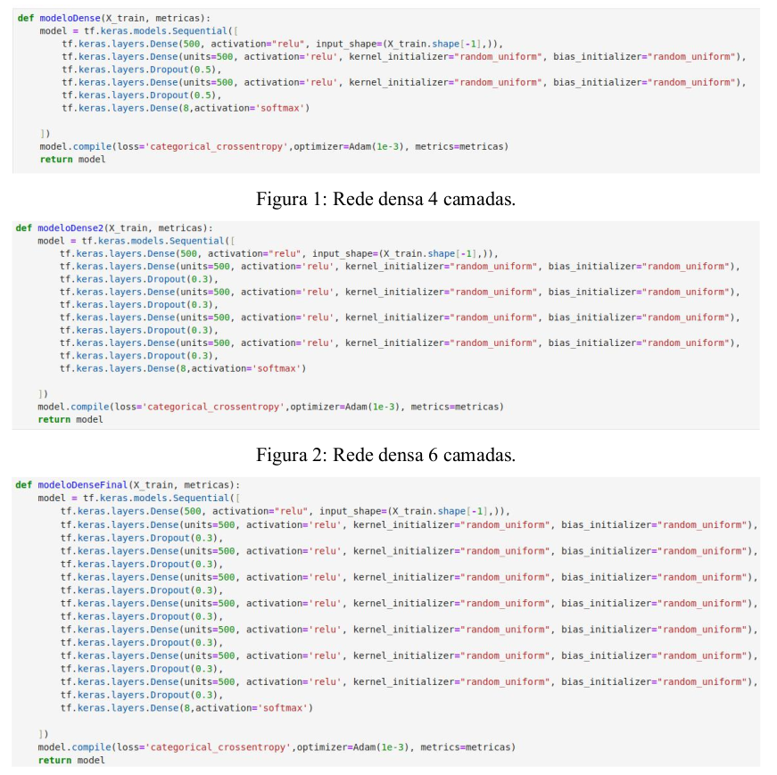

# Projeto IDS IoT com Rede DL

📡 **Projeto IDS IoT simplês com rede DL**  
🔍 Este projeto envolve a manipulação da base de dados, tratamento, criação do modelo, treinamento e validação.

🔥 **Foi utilizado o jupyter notebook** junto ao anaconda para dedsenvolver o projeto.
## 📂 Estrutura do Projeto

✅**Introdução**

O objetivo deste projeto é treinar uma rede neural para classificação de dados em um conjunto
de dados de ataques IoT. A rede neural será desenvolvida utilizando a biblioteca TensorFlow
com a interface Keras. O modelo será treinado para prever a classe correta para cada entrada
de dados.

✅**Conjunto de Dados**

O conjunto de dados CicIoT2023 que foi desenvolvido pelo
Instituto Canadense de
Segurança Cibernética (CIC) é utilizado nesse projeto contendo 33 dados de ataques que são
divididos em sete catégorias, sendo elas DDoS, DoS, Recon, Web-based, Brute Force,
Spoofing e Mirai.

✅**Pré-processamento dos Dados**

Antes do treinamento do modelo, os dados foram pré-processados da seguinte forma:
Como os dados originais são compostos por 33 rotulos distintos. Foi modificado os rotulos
conforme as classes de ataques, resultando em 8 classes para o treinamento do modelo. As
classes estão listadas a seguir:
DDoS, DoS, Mirai, Benign, Spoofing, Recon,Web, BruteForce.
Normalização das características para garantir que todas tenham a mesma escala.
Divisão do conjunto de dados em conjuntos de treinamento, validação e teste na proporção
X:Y:Z.
Foram criados bases de dados utilizando técnicas de smote e sampling para dados
desbalanceados.

✅**Arquitetura do Modelo**

Foi utilizado três arquiteturas de rede neural para o treinamento com os dados de IoT.

✅**Treinamento do Modelo**

    Modelo 1 foi treinado utilizando o algoritmo de otimização Adam com os seguintes
    parâmetros:
    Taxa de Aprendizado: 1e-3
    Função de Perda: categorical_crossentropy
    Métricas de Avaliação:False Negatives, False Positives, True Negatives, True Positives,
    Precision, RecallO treinamento foi realizado por 200 épocas com um tamanho de lote de 300.

    Modelo 2 foi treinado utilizando o algoritmo de otimização Adam com os seguintes
    parâmetros:
    Taxa de Aprendizado: 1e-3
    Função de Perda: categorical_crossentropy
    Métricas de Avaliação:False Negatives, False Positives, True Negatives, True Positives,
    Precision, Recall
    O treinamento foi realizado por 200 épocas com um tamanho de lote de 300.

    Modelo 3 foi treinado utilizando o algoritmo de otimização Adam com os seguintes
    parâmetros:
    Taxa de Aprendizado: 1e-3
    Função de Perda: categorical_crossentropy
    Métricas de Avaliação:False Negatives, False Positives, True Negatives, True Positives,
    Precision, Recall
    O treinamento foi realizado por 200 épocas com um tamanho de lote de 300.
    
✅**Avaliação do Modelo**

    Após o treinamento, os modelo foram avaliados utilizando o conjunto de teste separado. As
    seguintes métricas foram calculadas para avaliar o desempenho do modelo:
    
    Precisão
    Recall
    F1-Score
    Matriz de Confusão

✅**Conclusões**

    Com base nos resultados obtidos, podemos concluir que os modelos treinados com a base de
    dados normais, sem a aplicação de técnicas de sampling ou SMOTE, são capazes de atingir
    uma acurácia de 84% nos dados de teste. Após realizar melhorias na Rede 1, conseguimos
    aumentar essa acurácia para 87%.
    O modelo treinado pode fazer classificações com boa precisão. No entanto, ainda há espaço
    para melhorias, especialmente em relação a certas classes que foram mais difíceis de prever.
    Passos futuros podem incluir a experimentação com diferentes arquiteturas de rede,
    o ajuste de hiperparâmetros e o aumento da quantidade de dados para aprimorar ainda mais o desempenho do modelo.

